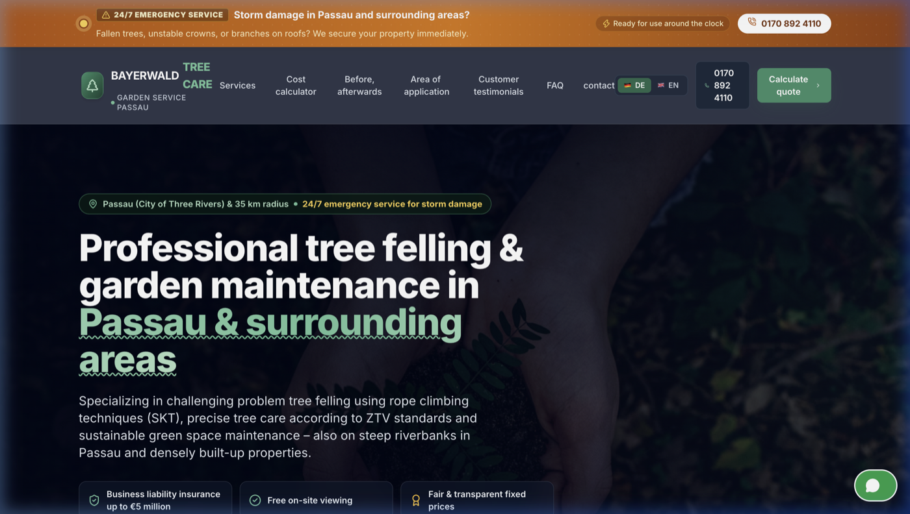
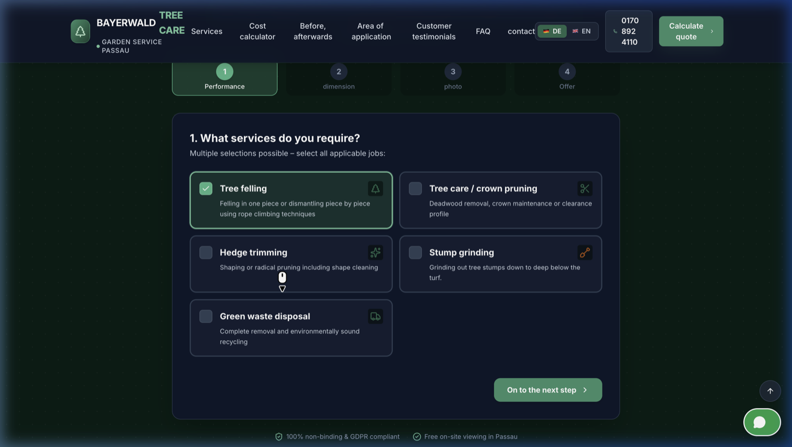
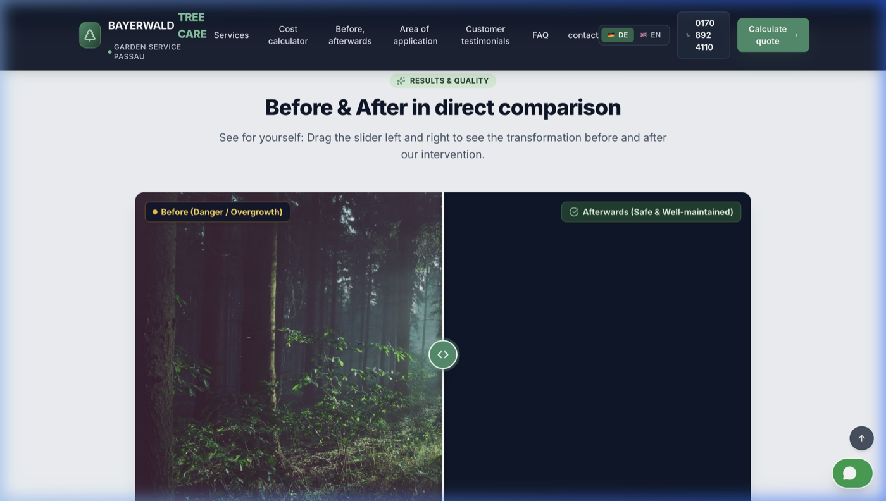

# 🌲 Bayerwald Baumpflege & Gartenservice Passau

[](https://imami123456.github.io/baumpflege-passau/)
[](https://www.typescriptlang.org/)
[](https://react.dev/)
[](https://tailwindcss.com/)
[](https://vitejs.dev/)
[](https://vitest.dev/)
[](.github/workflows/ci.yml)
[](LICENSE)

> A modern, responsive, bilingual (German & English) commercial single-page application built for an arboriculture and tree care service in Passau, Lower Bavaria. Features an interactive 4-step cost estimation engine, custom before/after media slider, bilingual localization with type-safe dictionaries, and a complete Vitest unit test suite.

---

## 📸 Screenshots

### Landing Page & Hero Section


### Interactive 4-Step Cost Estimator ("Kostenrechner")


### Before / After Comparison Slider


---

## 💡 Overview & Engineering Focus

This project was built to demonstrate clean frontend architecture, type-safe state handling, test-driven business logic, and practical German web compliance standards (DSGVO / Impressum § 5 DDG).

Rather than relying on heavy third-party UI component libraries or complex backend requirements, the application focuses on:
- **Clean Component Composition:** 14 modular React components with clear separation between stateful logic, presentation, and data utilities.
- **Pure Business Logic Separation:** The pricing estimation formula is implemented as a standalone, deterministic function decoupled from the React rendering cycle.
- **Type-Safe Internationalization:** A zero-dependency typed i18n system ensuring complete translation key symmetry across German and English at compile time.
- **Accessibility & UX Polish:** Interactive touch/keyboard comparison slider with ARIA controls, form validation with localized error messages, and mobile-friendly interactions.

---

## ✨ Key Features

### 1. 🧮 Interactive 4-Step Cost & Scope Estimator
- **Step 1 — Service Selection:** Multi-select chips for Tree Felling (*Fällung*), Crown Pruning (*Kronenschnitt*), Hedge Trimming (*Heckenschnitt*), Stump Grinding (*Wurzelstockfräsen*), and Green Waste Chipping (*Häckseln*).
- **Step 2 — Parameters & Accessibility:** Tree height slider (up to 30m+) with diameter estimations and terrain slope toggles (standard access vs. steep slope / river passage).
- **Step 3 — Site Photo Preview:** Drag-and-drop file upload with client-side image preview and validation.
- **Step 4 — Preliminary Calculation & Dispatch:** Calculates a transparent price range based on tree height, complexity multipliers, and disposal options. Provides 1-click formatted inquiry dispatch via WhatsApp or mailto client with celebratory confetti.
- **Direct Card Integration:** Clicking "Preis anfragen" on any marketing service card dispatches a custom event to preselect that service in the calculator and scrolls smoothly into view.

### 2. 🌐 Type-Safe Bilingual Localization (`DE` / `EN`)
- Full German (default) and English translations covering technical arboricultural terms (*Seilklettertechnik SKT*, *Problembaumfällung*, *Kronenpflege*, *ZTV-Baumpflege*).
- Language selection is managed via React Context and automatically persisted to `localStorage`.
- Typed dictionaries enforced via the `TranslationDictionary` interface, verified by automated parity tests.

### 3. 🪓 Interactive Before/After Work Comparison
- Drag-and-touch comparison slider component allowing users to evaluate work quality (overgrowth vs. trimmed/cleared property).
- Full keyboard accessibility with ARIA slider attributes (`aria-valuenow`, `aria-valuemin`, `aria-valuemax`).

### 4. 📋 Passau Regional Form Validation & Service Area
- Validates contact inquiries against Passau city postal codes (`94032`, `94034`, `94036`) and adjacent Bavarian Forest municipalities (`Salzweg`, `Fürstenzell`, `Vilshofen`, `Tiefenbach`, `Hauzenberg`, `Pocking` within a 35 km radius).
- Validates phone and email syntax with bilingual inline error feedback.

### 5. ⚖️ German Compliance & Structured SEO
- Legally compliant **Impressum** (§ 5 DDG) and **Datenschutz** (DSGVO / GDPR) policy modals.
- Schema.org `HomeAndConstructionBusiness` structured JSON-LD for local Passau SEO.

---

## 🏛️ Architecture & Technical Decisions

| Decision | Approach Chosen | Rationale & Trade-offs |
|---|---|---|
| **State Management** | React Context + `localStorage` | For a single-page marketing application, introducing Redux or Zustand adds unnecessary boilerplate. React Context provides clean global state for language preferences, while component state handles form steps. |
| **Pricing Calculation** | Pure TypeScript Functions (`src/utils/pricing.ts`) | Keeping calculation logic pure and decoupled from React hooks allows the pricing engine to be tested in isolation with 100% deterministic test cases and zero mock dependencies. |
| **Cross-Component Communication** | Custom DOM Events (`selectService`) | Service cards in the marketing section trigger pre-selection in the calculator. Using a custom DOM event avoided prop-drilling across unrelated component subtrees while keeping components decoupled. |
| **Internationalization** | Typed TypeScript Object Dictionary | Instead of adding heavy runtime i18n libraries (like `react-i18next`), a lightweight typed dictionary provides zero runtime overhead, instant bundle-friendly loading, and compile-time TypeScript verification. |
| **Styling** | Tailwind CSS with Domain Theme | Configured a custom earthy Bavarian timber palette (`forest` greens and `amber`/`timber` neutrals) directly in `tailwind.config.js` to create an organic, professional aesthetic matching the regional industry. |
| **Linting & Code Quality** | Oxlint + Strict TypeScript (`tsc -b`) | Ultra-fast Rust-based linting alongside strict TypeScript type-checking ensures rapid feedback in CI. |

---

## 🧪 Testing Suite

Automated unit tests are implemented using **Vitest** across 3 test suites:

- **`tests/pricing.test.ts`**: Tests the pricing formula across tree heights, service multipliers, disposal additions, and terrain complexity factors.
- **`tests/validation.test.ts`**: Tests contact form validation, email regex verification, phone number rules, and Passau postal code validation.
- **`tests/translations.test.ts`**: Tests translation key parity between the German and English dictionaries to guarantee no missing localization strings.

```bash
# Run test suite
npm run test

# Run tests in watch mode
npm run test:watch
```

---

## 🛠️ Tech Stack & Dependencies

- **Runtime & Framework:** React 19, TypeScript 5, Vite 6
- **Styling:** Tailwind CSS 3.4, Tailwind Merge
- **Icons & Effects:** Lucide React, Canvas Confetti
- **Testing:** Vitest
- **Tooling:** Oxlint, PostCSS, Autoprefixer
- **CI/CD:** GitHub Actions (linting, testing, type-checking, production build, GitHub Pages deployment)

---

## 📁 Project Structure

```
baumpflege-passau/
├── .github/
│   └── workflows/
│       ├── ci.yml               # Automated CI (lint, test, build)
│       └── deploy.yml           # Automated GitHub Pages deployment
├── docs/
│   └── images/                  # Application screenshots
│       ├── hero.png
│       ├── cost-estimator.png
│       └── before-after-slider.png
├── tests/
│   ├── pricing.test.ts          # Unit tests for cost calculation engine
│   ├── validation.test.ts       # Unit tests for form & postal code validation
│   └── translations.test.ts     # Dictionary key parity verification
├── src/
│   ├── components/
│   │   ├── Header.tsx           # Sticky frosted glass navbar & language switcher
│   │   ├── EmergencyBanner.tsx  # 24/7 storm damage emergency beacon
│   │   ├── Hero.tsx             # Hero banner with trust metrics & CTAs
│   │   ├── ServicesGrid.tsx     # 6 service offerings with direct calculator links
│   │   ├── CostEstimator.tsx    # 4-step interactive price calculator
│   │   ├── BeforeAfterSlider.tsx# Accessible drag comparison slider
│   │   ├── ServiceAreaPassau.tsx# Passau districts & 35 km radius overview
│   │   ├── AboutSection.tsx     # Equipment, team credentials & safety standards
│   │   ├── Testimonials.tsx     # Verified customer testimonials
│   │   ├── FAQSection.tsx       # Passau arboricultural FAQ accordion
│   │   ├── ContactSection.tsx   # Direct inquiry form, email, phone & depot address
│   │   ├── LegalModals.tsx      # Impressum (§ 5 DDG) & Datenschutz (DSGVO)
│   │   ├── CookieBanner.tsx     # Privacy notice banner
│   │   ├── FloatingActions.tsx  # Floating WhatsApp & phone call buttons
│   │   └── Footer.tsx           # Compliance links & local business info
│   ├── context/
│   │   ├── LanguageContext.tsx  # Context provider with localStorage sync
│   │   ├── useLanguage.ts       # Hook for accessing language state
│   │   └── languageContextDefinition.ts
│   ├── i18n/
│   │   └── translations.ts      # Complete DE / EN dictionary & types
│   ├── utils/
│   │   ├── pricing.ts           # Pure tree care pricing formula engine
│   │   └── validation.ts        # Postal code & input validation rules
│   ├── App.tsx                  # Root application component
│   ├── main.tsx                 # React DOM mount point
│   ├── vite-env.d.ts            # Vite client type declarations
│   └── index.css                # Tailwind base directives & utility animations
├── index.html                   # HTML template with SEO & Schema.org JSON-LD
├── tailwind.config.js           # Custom Bavarian forest/timber palette
├── tsconfig.json                # TypeScript project configuration
├── vite.config.ts               # Vite configuration with relative base path
└── package.json
```

---

## 🚀 Getting Started

### Prerequisites
- Node.js (version 18 or higher)
- npm, pnpm, or yarn

### Installation & Setup

1. **Clone the repository:**
   ```bash
   git clone https://github.com/Imami123456/baumpflege-passau.git
   cd baumpflege-passau
   ```

2. **Install dependencies:**
   ```bash
   npm install
   ```

3. **Start the local development server:**
   ```bash
   npm run dev
   ```
   Open `http://localhost:5173/` in your browser.

4. **Run the test suite:**
   ```bash
   npm run test
   ```

5. **Run the linter:**
   ```bash
   npm run lint
   ```

6. **Build for production:**
   ```bash
   npm run build
   npm run preview
   ```

---

## 📄 License

This project is open-source and available under the [MIT License](LICENSE).
